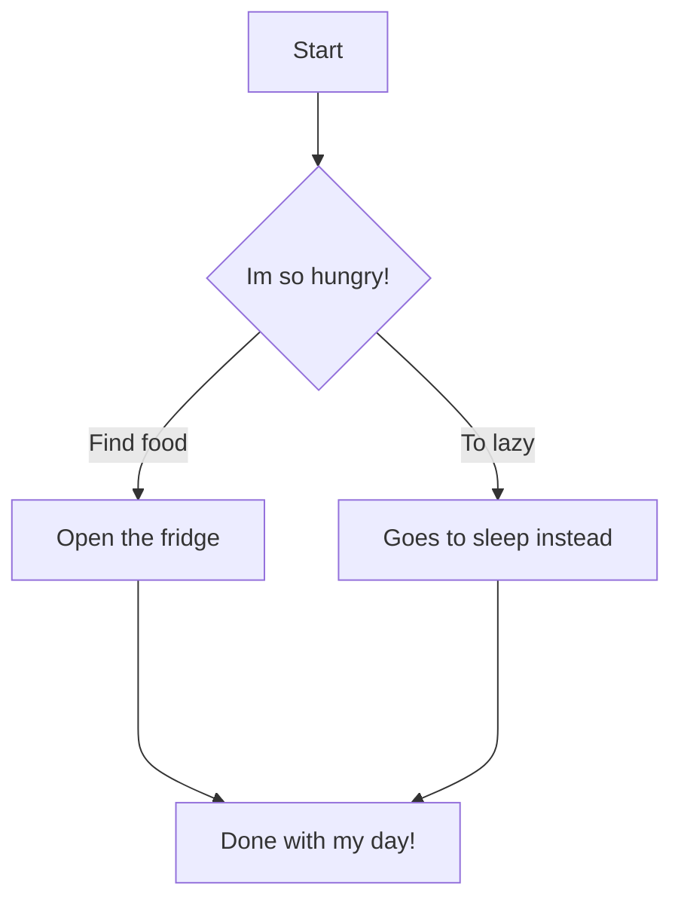

# Diagram.md.

The chart starts by saying im so hungry the then the two options below say find food or they are to lazy to. Choice C was to open the fridge and find food. Choice D was to go to sleep instead then it end with that being the end of the day.
