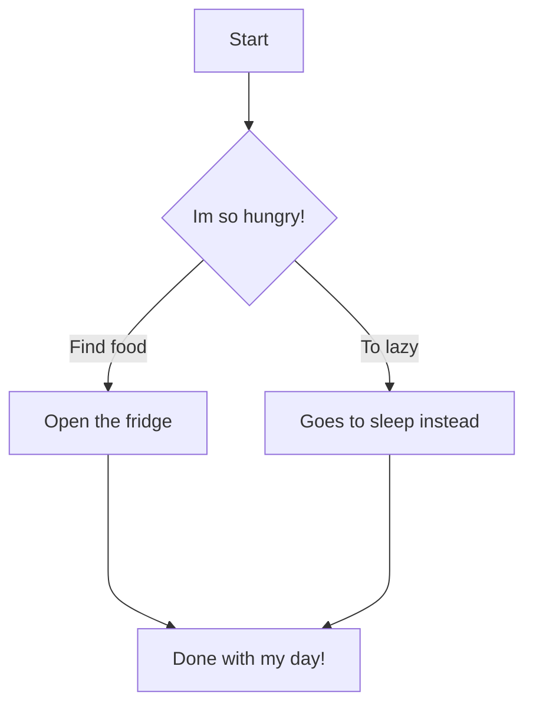

# Diagram.md.

```mermaid
flowchart TD
	A[Start] --> B{Im so hungry!};
	B -- Find food --> C[Open the fridge];
	B -- To lazy --> D[Goes to sleep instead];
	C ----> E[Done with my day!];
	D ----> E[Done with my day!];
```
	